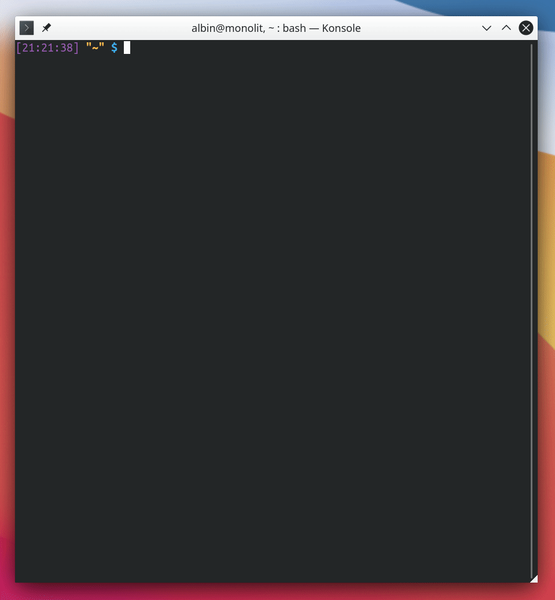

---
- [1. Syfte](#1-syfte)
- [2. Funktioner](#2-funktioner)
- [3. Installation](#3-installation)
  - [3.1. Windows](#31-windows)
  - [3.2. MacOS och Linux](#32-macos-och-linux)
    - [3.2.1. Beroenden](#321-beroenden)
    - [3.2.2. Vanlig installation](#322-vanlig-installation)
- [4. Användning](#4-användning)
- [5. Referens](#5-referens)

## 1. Syfte
__Vad är poängen med det här programmet?__

Programmet gör det något bekvämare att använda fjärranslutningar till andra datorer och servrar via SSH-protokollet`*` - dels genom att spara favoritanslutningar och dels genom att skifta färgtema på terminalfönstret. Färgskiftet gör det snabbt och enkelt att se vilka terminaler som är lokala och vilka som inte är det (vilket enligt en kompis kan minska risken att man göra dumma misstag).

>`*`SSH (Secure Shell) är ett protokoll som används för att säkert  och krypterat ansluta sig mot andra datorer över ett nätverk (både Internet och lokala sådana). SSH består av en serverdel, som vanligtvis lyssnar på port 22, och en klientdel. Den vanligaste implementationen är OpenSSH.

## 2. Funktioner
+ Alla talar svenska!
+ Lagra favorit-servrars anslutningsuppgifter.
+ Skiftar färg på terminalfönster vid anslutning. Återställer vid avslutning.
+ Testar innan uppkoppling om servern svarar på anrop på port 22.
+ ~~hashcat-integrering.~~
+ Bash-komplettering, d.v.s. automatisk ifyllning när man dubbelklickar på [TAB]-tangenten.

## 3. Installation
För att installera programmet i **Linux** och **MacOS** ger du bara programmet kör-rättigheter och kopierar det till en mapp som ligger i din __$PATH-variabel__`*` (t.ex. `"/usr/bin/"`), men i **Windows** måste du först aktivera Microsofts fräsiga **WSL** (Windows Subsystem for Linux).

>`*`$PATH-variabeln berättar för skalet (i det här fallet Bash) vilka mappar som datorns program ligger i. Alla mappar som är definierade i $PATH laddas liksom alltid som en stor bonusmapp efter att mappen som du faktiskt är i har laddats så att programmen som ligger däri alltid är nåbara utan att definiera deras fulla sökväg.

### 3.1. Windows
1. Följ först Microsofts officiella guide för att installera WSL ([Windows Subsystem for Linux Installation Guide for Windows 10](https://docs.microsoft.com/en-us/windows/wsl/install-win10)).
2. När WSL är aktiverat och du har valt en distribution från Microsoft Store (t.ex. [Ubuntu 20.04 LTS](https://www.microsoft.com/sv-se/p/ubuntu-2004-lts/9n6svws3rx71?rtc=1&activetab=pivot:overviewtab)) följer du samma instruktioner som för MacOS och Linux nedan.

### 3.2. MacOS och Linux
#### 3.2.1. Beroenden
<span style="color:red">För att allt ska funka måste du ha följande program installerade!</span>

+ **ssh**
+ **netcat**
+ konsole`*`

>`*`Programmet funkar finfint i andra terminalemulatorer, men saknar då möjlighet att skifta färg.

#### 3.2.2. Vanlig installation
För att installera programmet för alla användare, öppna en terminal och skriv in följande.

``` bash
# Ladda ned programmet!
git clone https://github.com/albinhenriksson/fjarrstyr
cd fjarrstyr

# Gör programmet körbart.
chmod +x fjärrstyr

# Installera i program-mappen.
sudo ln -s "$(realpath fjärrstyr)" /usr/bin/

# Slutligen, aktivera programmets komplettering.
echo "source \"$(realpath _fjarrstyr)\"" | sudo tee --append /etc/profile
```

## 4. Användning
``` bash
$ fjärrstyr --help

Användning:
fjärrstyr [server]
kommer att ansluta användaren till servern "[server]".

fjärrstyr -l
skriver ut en lista på sparade anslutningar.

fjärrstyr -h
visar det här hjälpfönstret.

Beroenden:
ssh, netcat, (konsole).

Beskrivning:
Programmet ansluter användaren till en vald server m.h.a. Secure Shell-
protokollet (SSH). Vid anslutning byts även färgtemat i användarens terminal
ut för att göra det lättare att se skillnad på terminalfönster.

Om terminalemulatorn Konsole används ändras färgemat till "SSH" vid anslutning
och återställs till "Breeze" vid slutföring.

Konfiguration:
Programmet letar efter sparade anslutningar i filen "$HOME/.fjärrstyr".

Filen ska följa följande mönster:
NAMN ANVÄNDARE SERVERADRESS

Exempel:
jobb_server ulf mittjobb.se
botnet4 root 84.221.147.159
speldator cspro91 192.168.1.42
```

## 5. Referens
+ [SSH (Secure Shell)](https://sv.wikipedia.org/wiki/Secure_Shell)
+ [Bash Programmable Completion](https://www.gnu.org/software/bash/manual/bash.html#Programmable-Completion)
+ [PATH Definition](http://www.linfo.org/path_env_var.html)
+ [The Environment Variable TERM](https://www.gnu.org/software/gettext/manual/html_node/The-TERM-variable.html)
+ [Windows Subsystem for Linux Installation Guide for Windows 10](https://docs.microsoft.com/en-us/windows/wsl/install-win10)
